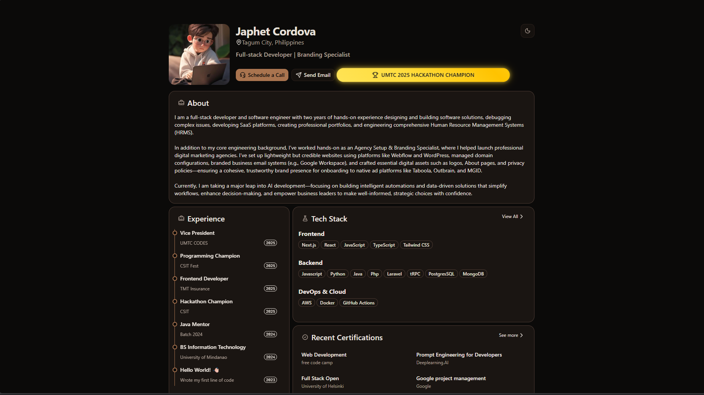
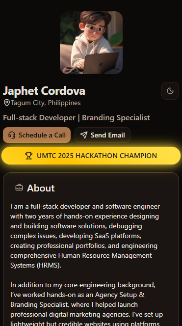

# Japhet Cordova’s Portfolio – Modern, Interactive, and Recruiter-Friendly Developer Showcase
Japhet Cordova’s portfolio website stands out with its sleek, modern design powered by Next.js and Tailwind CSS, seamless integration with Sanity.io for real-time content updates, and lightning-fast performance. Recruiters love it for its intuitive navigation, mobile responsiveness, and clear presentation of skills, projects, and achievements. The site features interactive UI components, optimized images, and a robust backend, making it not just a portfolio, but a true demonstration of professional-grade web development and user experience.

---

## Table of Contents

- [Features](#features)
- [Screenshots](#screenshots)
- [Tech Stack](#tech-stack)
- [Installation](#installation)
- [Usage](#usage)
- [Project Structure](#project-structure)
- [Testing](#testing)
- [Contributing](#contributing)
- [License](#license)
- [Contact](#contact)

---

## Features

### Core Management
- **Event Management:** Create, edit, delete, and organize events
- **Session Management:** Manage multiple sessions per event with time slots
- **Room Management:** Organize rooms within sessions
- **Student Management:** Complete CRUD operations for student data
- **Hierarchical Data Structure:** Events → Sessions → Rooms → Students

### Data Features
- **Pagination:** Efficient data browsing with configurable page sizes
- **Sorting:** Sort students by ID, name, year level, and program
- **Search & Filter:** Advanced filtering capabilities
- **Real-time Updates:** Instant data synchronization across components

### User Interface
- **Material-UI Design:** Modern, responsive interface
- **Grid Layout:** Organized 4-column layout for easy navigation
- **Interactive Tables:** Click-to-select functionality
- **Notification System:** Success/error feedback for all operations
- **Modal Dialogs:** Clean forms for data entry and editing

### Advanced Features
- **State Management:** React hooks for efficient state handling
- **Custom Hooks:** Reusable logic for CRUD operations
- **Data Validation:** Form validation and error handling
- **Responsive Design:** Works on desktop and mobile devices
- **Auto-selection:** Smart default selections for better UX

### Additional Capabilities
- **Barcode Scanner Integration:** Ready for QR/barcode scanning
- **OCR Processing:** Text recognition capabilities with Tesseract.js
- **Webcam Integration:** Camera functionality for document scanning
- **Data Export:** Export capabilities (ready for implementation)

---

## Screenshots

| Desktop | Mobile |
|----------|------|
| | |

---

## Tech Stack

**Frontend:**
- React 19.1.0
- Next.js 15.x
- Tailwind CSS 4.x
- TypeScript

**Backend:**
- Sanity.io (Headless CMS)
- Node.js (API routes if applicable)

**UI Components:**
- Custom React components
- Shadcn/UI
- Lucide Icons

**Advanced Features:**
- Real-time updates with Sanity
- Image optimization
- Responsive design
- Custom hooks for data fetching

**Development:**
- ESLint & Prettier
- Hot Module Replacement (HMR)
- Environment variable support
- VS Code

---

## Installation

```bash
# Clone the repository
git https://github.com/japhetcordova/next-japhetcordova.git
cd next-japhetcordova

# Install dependencies
npm install

# Start the development server
npm run dev

# Build for production
npm run build

# Preview production build
npm run preview
```

## Usage

- Start the development server with `npm run dev` and visit [http://localhost:5173](http://localhost:5173).
- Use the navigation to manage events, sessions, rooms, and students.
- For production, run `npm run build` and `npm run preview`.

---

## Project Structure

- `/src` — Main source code
- `/components` — Reusable UI components
- `/pages` or `/routes` — Application routes
- `/hooks` — Custom React hooks
- `/styles` — Global and component styles

---

## Testing

- Add and run tests using your preferred framework (e.g., Jest, React Testing Library).
- Example:
  ```bash
  npm run test
  ```
